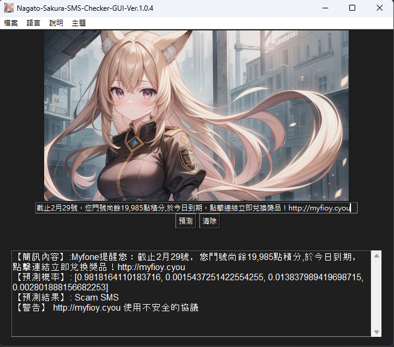
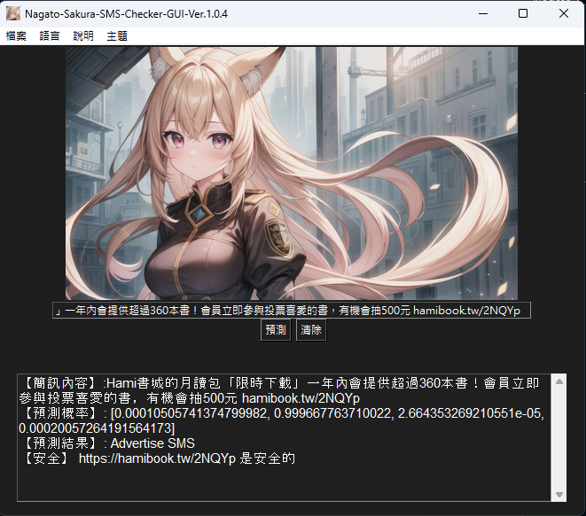
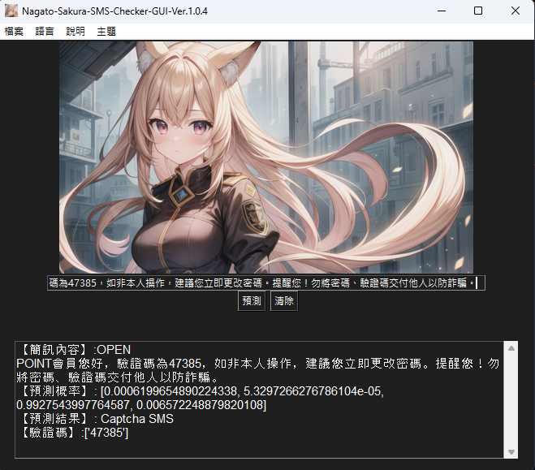
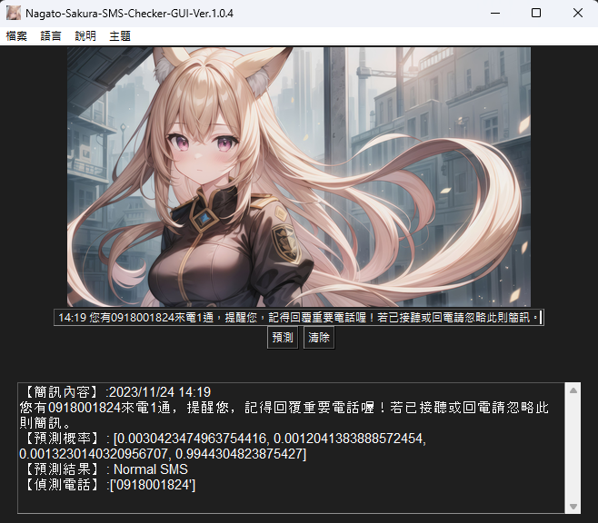

# Nagato-Sakura-SMS-Checker

[](https://github.com/AmanoShizukikun/Nagato-Sakura-SMS-Checker/stargazers)
[](https://github.com/AmanoShizukikun/Nagato-Sakura-SMS-Checker/commits/main)
[](https://github.com/AmanoShizukikun/Nagato-Sakura-SMS-Checker/releases)

\[ 中文 | [English](README_en.md) | [日本語](README_jp.md) \]

## 介紹
Nagato-Sakura-SMS-Checker 是「長門櫻計畫」的其中一個分支，是為了解決簡訊詐騙而自製的小型簡訊分類模型，可以分類簡訊類型、判斷簡訊中的電話及網址並且測試網址的響應狀態判斷網站是否安全。

## 公告
- ### Project-SMS 正式改名為 「Nagato-Sakura-SMS-Checker」，並且併入「長門櫻計畫」，Project-SMS (3.0.0以前)的舊檔案將完全移除， Nagato-Sakura-SMS-Checker 版本從 1.0.0 重新開始
- ### 目前中止 Nagato-Sakura-SMS-Checker 的打包 .exe 計畫，直到找到更有效率的的 Pytorch 模型打包方法。

## 近期變動
### 1.0.2（2024 年 2 月 23 日）

### 重要變更
- 【調整】GUI 調整了顯示的方式，統一使用滾動文字框來顯示訊息，看起來更加精簡美觀。
- 【調整】調整了 GUI 以及一般測試程式的終端機顯示，現在終端機顯示的結果更整齊，更方便使用者讀取。
- 【調整】模型訓練資料刪除部分無要資訊並且稍微調整了訓練參數，預測精準度相較舊版有明顯提升。
### 新增功能
- 【新增】現在能判斷「非」 http 及 www 開頭的網站，並且能自動轉換縮寫網址為原本正確的完整網址。
### 已知問題
- 【錯誤】短網址類型的網站只能判斷到縮網址的地方，無法判斷縮網址後的網站。
- 【錯誤】畫面縮放時，程式的UI不會跟著縮放。

### 1.0.1（2024 年 2 月 21 日）

### 重要變更
- 【調整】GUI 調整了模型加載的順序，並且新增了線程來進行網址檢查，大幅提高了 GUI 的反應速度。
- 【調整】改善了網址判斷的方式，現在可以建立 SSL/TLS 連線並取得證書以及檢查網址路徑是否包含可疑模式。
- 【調整】深色模式，調整了深色模式的按鈕的顏色。
### 新增功能
- 【新增】清除鍵，現在程式可以一鍵清除網址，大幅提升了使用的方便性。
### 已知問題
- 【錯誤】畫面縮放時，程式的UI不會跟著縮放。
  
### 1.0.0（2024 年 2 月 19 日）

### 重要變更
- 【重大】專案正式改名為 「Nagato-Sakura-SMS-Checker」，並且移除了Project-SMS 3.0.0 (包含3.0.0) 以前的舊版本檔案。
- 【重大】重新上傳了已經訓練好的模型檔。
- 【調整】調整了訓練的資料檔，刪除部分有可能影響到簡訊判斷的無要內容。
### 新增功能
- 【新增】簡訊內容偵測功能，可以將簡訊中的電話(限台灣地區)及網址並列出來。
- 【新增】網址檢測功能，可以測試網站的響應狀態來判斷該網址是否安全。
- 【新增】狀態欄，避免了測試網站的狀態碼超出GUI的問題。
- 【新增】深色模式，現在程式可以在淺色模式與深色模式之間切換了。
### 已知問題
- 【錯誤】畫面縮放時，程式的UI不會跟著縮放。

## 快速開始
 **粗體** 的是強制要求的。
### 系統需求
- 系統需求: 64-bit Windows
- **處理器**: 64 位元的處理器
- **記憶體**: 2GB
- 顯示卡: 1GB VRAM 且支援 CUDA 加速的 NVIDIA 顯示卡
- **儲存空間**: 3GB 可用空間

### 環境設置
- **Python 3**
- 下載: https://www.python.org/downloads/windows/
- **PyTorch**
- 下載: https://pytorch.org/
- NVIDIA GPU驅動程式
- 下載: https://www.nvidia.com/zh-tw/geforce/drivers/
- NVIDIA CUDA Toolkit
- 下載: https://developer.nvidia.com/cuda-toolkit
- NVIDIA cuDNN
- 下載: https://developer.nvidia.com/cudnn
- Python庫
```shell
pip install Pillow
pip install requests
```

### 檔案說明
- 必要檔案
  - train.py:訓練程式
  - test.py:測試程式 (CMD版本)
  - Nagato-Sakura-SMS-Checker-GUI:測試程式 (GUI版本)
  - SMS_data.json:訓練資料庫
  
- 附加檔案(透過train.py生成)
  - config.json:模型配置文件
  - labels.txt:標籤文件
  - SMS_model.bin:模型
  - tokenizer.json:詞彙表

### 安裝
```shell
git clone https://github.com/AmanoShizukikun/Nagato-Sakura-SMS-Checker.git
cd Nagato-Sakura-SMS-Checker
```

- 修改訓練資料庫
```shell
.\SMS_data.json
```

- 開始訓練
```shell
python train.py
```

- 開始測試
```shell
python test.py
```


## GUI 介面
- 開啟GUI
```shell
python Nagato-Sakura-SMS-Checker-GUI.py
```
### GUI 主題
目前 GUI 有兩種主題分別為淺色模式以及深色模式，使用右下角的按鍵即可進行淺色模式以及深色模式切換


## GUI 實際使用範例
### 範例 1
簡訊內容: 本週6164華興成功獲利40趴 下週強勢飆股已選出 趕緊加賴領取：

這種簡訊是台灣常見的投資詐騙手法，誘使投資人加入Line群組再進行詐騙，讓我們一起看看長門櫻的辨識結果:



長門櫻成功識別出了疑似詐騙的訊息，並且偵測出簡訊中的網址並進行基礎的檢查，這裡我們可以看到網址使用的是http而非https所以長門櫻發出了警告訊息提示使用者該連結有一定的風險。

### 範例 2
簡訊內容: Hami書城的月讀包「限時下載」一年內會提供超過360本書！會員立即參與投票喜愛的書，有機會抽500元 hamibook.tw/2NQYp

這種簡訊是台灣常見的電信廣告，不管是中華電信、亞太電信都會收到，這個網址還是簡訊有時會有的特殊縮網址，這種高難度的問題長門櫻做得出來嗎?



長門櫻成功識別出了廣告訊息，並且將原本無法透過偵測http及www開頭的網址成功偵測出來，並且轉換成正確的網址並測試網址，看來這個廣告是安全的沒有任何問題。

### 範例 3
簡訊內容: OPEN POINT會員您好，驗證碼為47385，如非本人操作，建議您立即更改密碼。提醒您！勿將密碼、驗證碼交付他人以防詐騙。

這種簡訊是常見的驗證碼簡訊，讓我們看看長門櫻會怎麼做?



長門櫻成功識別出了驗證碼簡訊，但是目前1.0.2版本的長門櫻還無法像 apple 公司那麼厲害可以將簡訊內的驗證碼提取出來，看來長門櫻還需要加油啊。

### 範例 4
簡訊內容: 2023/11/24 14:19 您有0918001824來電1通，提醒您，記得回覆重要電話喔！若已接聽或回電請忽略此則簡訊。

這種簡訊是每個人多少會有的未接來電訊息，長門櫻會怎麼做呢?



長門櫻將未接來電訊息分類到了一般訊息，並且正確的讀取到了訊息中的電話號碼，實在是太厲害了讓我們一起為長門櫻鼓掌。

### 範例 EX
簡訊內容: 【亞太電信帳務通知】您本期帳單金額為349元，本期帳單將合併於下期寄送，帳單資訊查詢及線上繳費請利用本公司行動客服APP  、官網會員專區  ；也可利用手機直撥988語音或7-11 ibon繳費，若已繳費無需理會本通知，謝謝。

長門櫻表示剛剛我們做的事實在是太小看她了，要我們試試一次給她兩個或以上的網址，長門櫻啊千萬別逞強啊。


長門櫻成功識別出了亞太電信傳的一般訊息，也成功識別出了兩個網址，並且分別進行安全性測試，亞太電信你網站能弄好嗎? 不是 SSL 問題就是 HOST NOT FOUND 工程師實在是太混了 WWW 。
