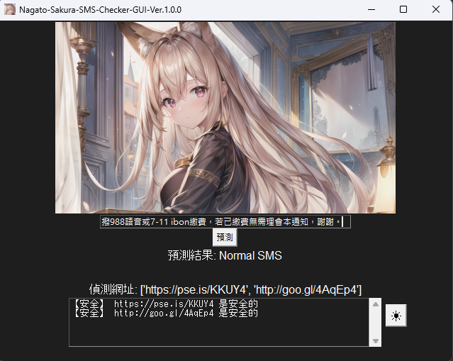
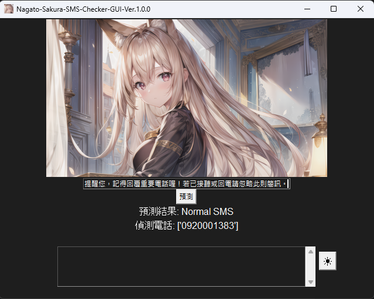

# Nagato-Sakura-SMS-Checker

[](https://github.com/AmanoShizukikun/Nagato-Sakura-SMS-Checker/stargazers)
[](https://github.com/AmanoShizukikun/Nagato-Sakura-SMS-Checker/commits/main)
[](https://github.com/AmanoShizukikun/Nagato-Sakura-SMS-Checker/releases)


\[ [中文](README.md) | English  | [日本語](README_jp.md) \]

## Introduction
Nagato-Sakura-SMS-Checker is one of the branches of the "Nagato Sakura Project," created to combat SMS scams. It is a small-scale SMS classification model designed to categorize types of SMS, identify phone numbers and URLs within SMS, and test the response status of URLs to determine if a website is secure.

## Announcements
- ### Project-SMS has officially been renamed to "Nagato-Sakura-SMS-Checker" and merged into the "Nagato Sakura Project." Old files from Project-SMS (prior to version 3.0.0) will be completely removed. Nagato-Sakura-SMS-Checker starts fresh from version 1.0.0.
- ### The plan to package Nagato-Sakura-SMS-Checker into a .exe file is currently suspended until a more efficient PyTorch model packaging method is found.

## Recent Changes
### 1.0.1 (February 20, 2024)

### Important Changes
- [Adjustment] GUI adjusted the order of model loading and added threads for URL checking, significantly improving GUI responsiveness.
- [Adjustment] Improved the method of URL detection, now capable of establishing SSL/TLS connections, obtaining certificates, and checking for suspicious patterns in URL paths.
- [Adjustment] Dark mode, adjusted the color of buttons in dark mode.
### New Features
- [New] Clear button, now the program can clear URLs with one click, greatly enhancing usability.
### Known Issues
- [Error] When scaling the screen, the UI of the program does not scale accordingly.
  
### 1.0.0 (February 19, 2024)

### Important Changes
- [Major] The project has been officially renamed to "Nagato-Sakura-SMS-Checker" and old version files before Project-SMS 3.0.0 (including 3.0.0) have been removed.
- [Major] Re-uploaded pre-trained model files.
- [Adjustment] Adjusted training data files, removing irrelevant content that may affect SMS judgment.
### New Features
- [New] SMS content detection feature, capable of listing phone numbers (limited to Taiwan) and URLs from SMS.
- [New] URL detection feature, capable of testing website response status to determine the safety of the URL.
- [New] Status bar, avoiding issues with status codes of tested websites exceeding GUI boundaries.
- [New] Dark mode, the program can now switch between light and dark modes.
### Known Issues
- [Error] When scaling the screen, the UI of the program does not scale accordingly.


## Quick Start
**Items in bold are mandatory requirements.**

### Hardware Requirements
1. Operating System: Windows
2. **CPU** / Nvidia GPU

### Environment Setup
- **Python 3**
- Download: [Python](https://www.python.org/downloads/windows/)
- **PyTorch**
- Download: [PyTorch](https://pytorch.org/)
- NVIDIA GPU Driver
- Download: [NVIDIA Drivers](https://www.nvidia.com/zh-tw/geforce/drivers/)
- NVIDIA CUDA Toolkit
- Download: [CUDA Toolkit](https://developer.nvidia.com/cuda-toolkit)
- NVIDIA cuDNN
- Download: [cuDNN](https://developer.nvidia.com/cudnn)

### File Descriptions
- Mandatory Files
  - train.py: Training program
  - test.py: Testing program (CMD Ver.)
  - Nagato-Sakura-SMS-Checker-GUI:Testing program (GUI Ver.)
  - SMS_data.json: Training database
  
- Additional Files (Generated via train.py)
  - config.json: Model configuration file
  - labels.txt: Label file
  - SMS_model.bin: Model
  - tokenizer.json: Vocabulary

### Installation
```shell
git clone https://github.com/AmanoShizukikun/Nagato-Sakura-SMS-Checker.git
cd Nagato-Sakura-SMS-Checker
```

- Modify the training database
```shell
.\SMS_data.json
```

- Start training
```shell
python train.py
```

- Start testing
```shell
python test.py
```

### GUI
- Launch the GUI
```shell
python Nagato-Sakura-SMS-Checker-GUI.py
```

- The button in the bottom right corner allows toggling between dark mode and light mode.


## Examples
- ### Normal SMS with URL


- ### Normal SMS with Phone Number


- ### Suspicious SMS with Problematic URL
