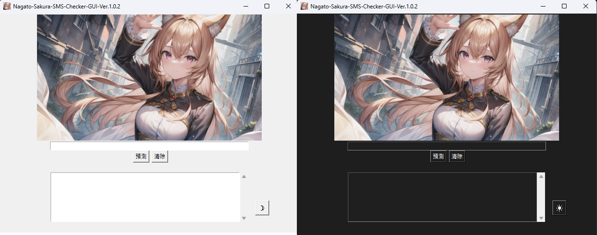
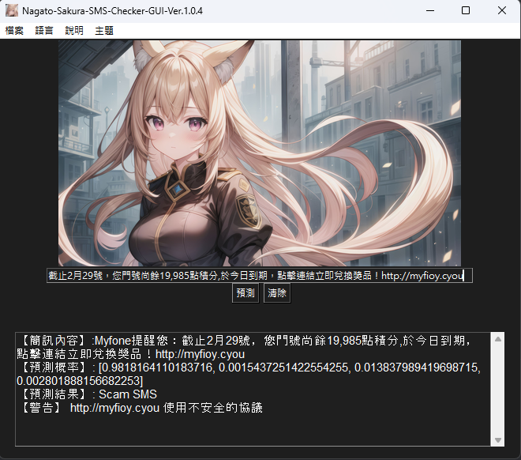
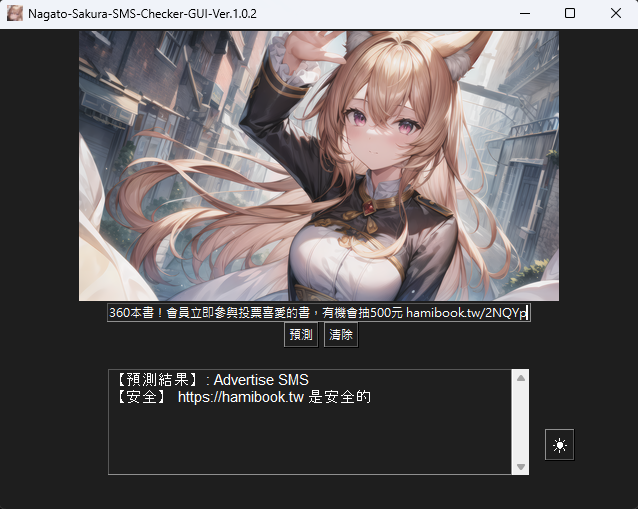
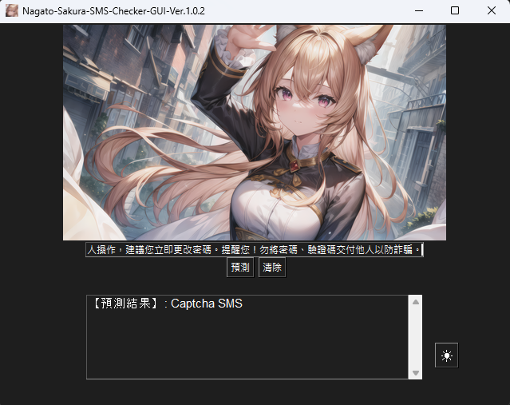
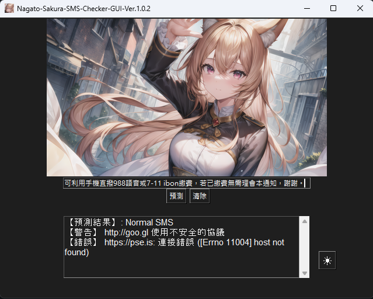

# Nagato-Sakura-SMS-Checker

[](https://github.com/AmanoShizukikun/Nagato-Sakura-SMS-Checker/stargazers)
[](https://github.com/AmanoShizukikun/Nagato-Sakura-SMS-Checker/commits/main)
[](https://github.com/AmanoShizukikun/Nagato-Sakura-SMS-Checker/releases)


\[ [中文](README.md) | English  | [日本語](README_jp.md) \]

## Introduction
Nagato-Sakura-SMS-Checker is one of the branches of the "Nagato Sakura Project," created to combat SMS scams. It is a small-scale SMS classification model designed to categorize types of SMS, identify phone numbers and URLs within SMS, and test the response status of URLs to determine if a website is secure.

## Announcements
- ### Project-SMS has officially been renamed to "Nagato-Sakura-SMS-Checker" and merged into the "Nagato Sakura Project." Old files from Project-SMS (prior to version 3.0.0) will be completely removed. Nagato-Sakura-SMS-Checker starts fresh from version 1.0.0.
- ### The plan to package Nagato-Sakura-SMS-Checker into a .exe file is currently suspended until a more efficient PyTorch model packaging method is found.

## Recent Changes
### 1.0.2 (February 23, 2024)

### Important Changes
- [Adjustment] The GUI display has been adjusted to use scrolling text boxes uniformly, providing a more streamlined and visually appealing appearance.
- [Adjustment] The GUI and terminal display for general testing have been modified for a neater presentation, making it easier for users to read.
- [Adjustment] Removed unnecessary information from the model training data and fine-tuned the training parameters. The predictive accuracy has significantly improved compared to the previous version.
### New Features
- [New] The ability to recognize "non-" http and www starting URLs, automatically converting abbreviated URLs to their correct full forms.
### Known Issues
- [Error] Only able to recognize the shortened URL part of short URL-type websites, unable to recognize the website after the shortened URL.
- [Error] When scaling the screen, the UI of the program does not scale accordingly.

### 1.0.1 (February 21, 2024)

### Important Changes
- [Adjustment] GUI adjusted the order of model loading and added threads for URL checking, significantly improving GUI responsiveness.
- [Adjustment] Improved the method of URL detection, now capable of establishing SSL/TLS connections, obtaining certificates, and checking for suspicious patterns in URL paths.
- [Adjustment] Dark mode, adjusted the color of buttons in dark mode.
### New Features
- [New] Clear button, now the program can clear URLs with one click, greatly enhancing usability.
### Known Issues
- [Error] When scaling the screen, the UI of the program does not scale accordingly.
  
### 1.0.0 (February 19, 2024)

### Important Changes
- [Major] The project has been officially renamed to "Nagato-Sakura-SMS-Checker" and old version files before Project-SMS 3.0.0 (including 3.0.0) have been removed.
- [Major] Re-uploaded pre-trained model files.
- [Adjustment] Adjusted training data files, removing irrelevant content that may affect SMS judgment.
### New Features
- [New] SMS content detection feature, capable of listing phone numbers (limited to Taiwan) and URLs from SMS.
- [New] URL detection feature, capable of testing website response status to determine the safety of the URL.
- [New] Status bar, avoiding issues with status codes of tested websites exceeding GUI boundaries.
- [New] Dark mode, the program can now switch between light and dark modes.
### Known Issues
- [Error] When scaling the screen, the UI of the program does not scale accordingly.


## Quick Start
**Items in bold are mandatory requirements.**

### Hardware Requirements
1. Operating System: Windows
2. **CPU** / Nvidia GPU

### Environment Setup
- **Python 3**
- Download: [Python](https://www.python.org/downloads/windows/)
- **PyTorch**
- Download: [PyTorch](https://pytorch.org/)
- NVIDIA GPU Driver
- Download: [NVIDIA Drivers](https://www.nvidia.com/zh-tw/geforce/drivers/)
- NVIDIA CUDA Toolkit
- Download: [CUDA Toolkit](https://developer.nvidia.com/cuda-toolkit)
- NVIDIA cuDNN
- Download: [cuDNN](https://developer.nvidia.com/cudnn)

### File Descriptions
- Mandatory Files
  - train.py: Training program
  - test.py: Testing program (CMD Ver.)
  - Nagato-Sakura-SMS-Checker-GUI:Testing program (GUI Ver.)
  - SMS_data.json: Training database
  
- Additional Files (Generated via train.py)
  - config.json: Model configuration file
  - labels.txt: Label file
  - SMS_model.bin: Model
  - tokenizer.json: Vocabulary

### Installation
```shell
git clone https://github.com/AmanoShizukikun/Nagato-Sakura-SMS-Checker.git
cd Nagato-Sakura-SMS-Checker
```

- Modify the training database
```shell
.\SMS_data.json
```

- Start training
```shell
python train.py
```

- Start testing
```shell
python test.py
```

### GUI
- Launch the GUI
```shell
python Nagato-Sakura-SMS-Checker-GUI.py
```

### GUI Theme
Currently, the GUI has two themes: light mode and dark mode. You can switch between them using the button in the bottom right corner.



## GUI Usage Examples
### Example 1
SMS Content: This week, 6164 Huaxing made a profit of 40%, and next week's strong stock has been selected. Hurry up and add LINE to claim:

This type of SMS is a common investment scam in Taiwan, enticing investors to join LINE groups for fraud. Let's take a look at Nagato Sakura's recognition results:



Nagato Sakura successfully identified the suspicious message and detected the URLs in the SMS for basic checks. Here, we can see that the URL uses http instead of https, so Nagato Sakura issued a warning message to alert users to the potential risks of the link.

### Example 2
SMS Content: Hami Bookstore's monthly reading package "Limited Time Download" will provide over 360 books in a year! Members can immediately participate in voting for their favorite books, with a chance to win 500 yuan at hamibook.tw/2NQYp.

This type of SMS is a common telecom advertisement in Taiwan, received by both Chunghwa Telecom and Asia Pacific Telecom. Sometimes, the URL in such messages is a special shortened URL in the SMS. Can Nagato Sakura handle this challenging task?



Nagato Sakura successfully identified the advertising message and managed to detect the URLs that couldn't be detected through the detection of URLs starting with http and www. It then converted them into correct URLs and tested them. It seems that this advertisement is safe without any problems.

### Example 3
SMS Content: OPEN POINT member, your verification code is 47385. If this was not initiated by you, we recommend you change your password immediately. Reminder! Do not disclose your password or verification code to others to prevent fraud.

This type of SMS is a common verification code SMS. Let's see how Nagato Sakura handles it.



Nagato Sakura successfully identified the verification code SMS. However, in version 1.0.2, Nagato Sakura cannot extract the verification code from the SMS like Apple can. It seems that Nagato Sakura still needs to work harder.

### Example 4
SMS Content: 2023/11/24 14:19 You have missed call from 0918001824, reminding you to reply to important calls! If you have answered or returned the call, please ignore this SMS.

This type of SMS is a missed call message that almost everyone receives. How does Nagato Sakura handle it?


Nagato Sakura categorized the missed call message as a normal message and correctly read the phone number from the message. It's really impressive. Let's give Nagato Sakura a round of applause.

### Example EX
SMS Content: [Asia Pacific Telecom Billing Notice] Your current bill amount is 349 yuan. This bill will be combined and sent in the next period. For bill inquiries and online payment, please use our company's mobile customer service APP, official website member area; you can also use your mobile phone to directly dial 988 for voice or pay at 7-11 ibon. If the payment has been made, please disregard this notice. Thank you.

Nagato Sakura says that what we just did is underestimating her. She wants us to try giving her two or more URLs. Nagato Sakura, please don't be too hard on yourself.



Nagato Sakura successfully identified the general message from Asia Pacific Telecom and also identified two URLs. It then performed security tests on them separately. Asia Pacific Telecom, can your website be fixed? It's either an SSL issue or a HOST NOT FOUND issue. Your engineers are really confused with the WWW.
